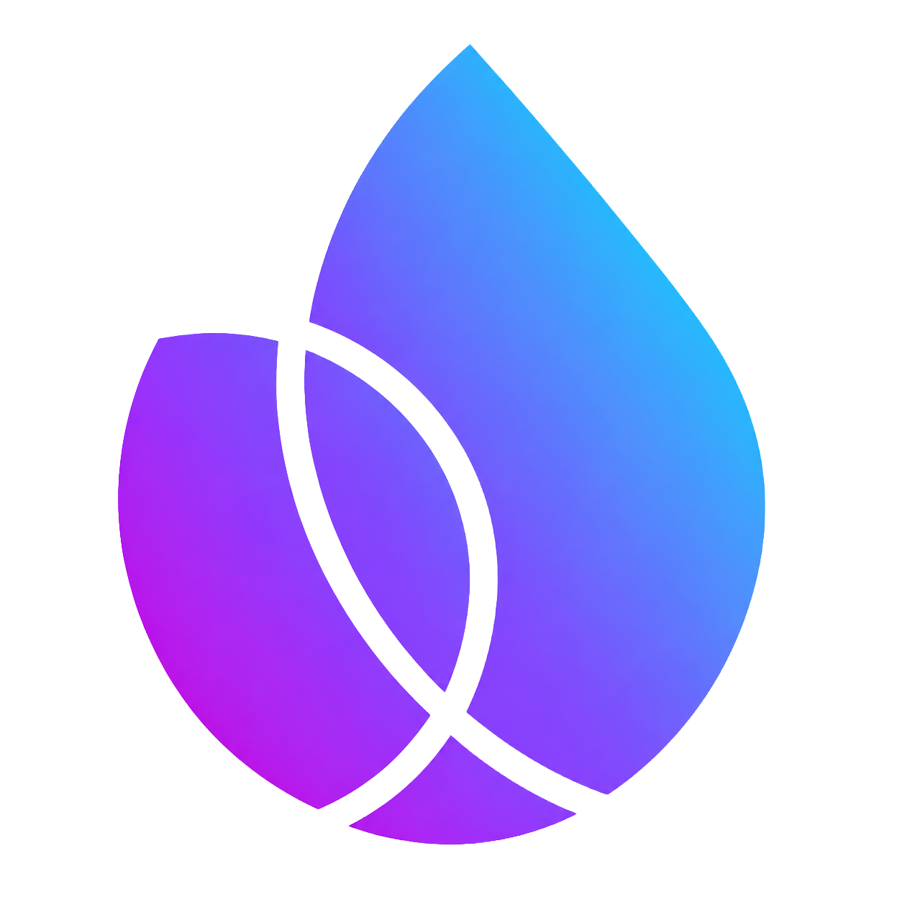

<p align="center">
  
</p>

# Firebase Kotlin SDK

**English** | [한국어](README_ko.md)


[](https://kotlinlang.org)
[](https://kotlinlang.org/docs/multiplatform.html)

A Kotlin Multiplatform (KMP) wrapper around Firebase platform SDKs, designed to expose native Kotlin-first APIs for Android and iOS projects.

---

## Features

- **Kotlin-First Design**: Native support for Coroutines (`suspend` functions) and asynchronous stream processing (`Flow`).
- **Thin & Light Adaption**: Implements clean expect/actual wrappers that delegate directly to official Firebase Android (GMS/Maven) and iOS (Apple SwiftPM) SDKs.
- **Platform Integrity**: Unsupported iOS platform features gracefully fallback with descriptive stubs rather than crashing on build time.

### Supported Services Matrix

| Firebase Feature | Android Support | iOS Support | Completion Rate | Under the Hood |
| :--- | :---: | :---: | :---: | :--- |
| **Authentication** (`firebase-auth`) | 🟢 Yes | 🟢 Yes | **95%** | Native GMS / iOS SwiftPM SDK |
| **Cloud Firestore** (`firebase-firestore`) | 🟢 Yes | 🟢 Yes | **90%** | Native GMS / iOS SwiftPM SDK |
| **Realtime Database** (`firebase-database`) | 🟢 Yes | 🟢 Yes | **85%** | Native GMS / iOS SwiftPM SDK |
| **Cloud Storage** (`firebase-storage`) | 🟢 Yes | 🟢 Yes | **90%** | Native GMS / iOS SwiftPM SDK |
| **Cloud Functions** (`firebase-functions`) | 🟢 Yes | 🟢 Yes | **95%** | Native GMS / iOS SwiftPM SDK |
| **Remote Config** (`firebase-config`) | 🟢 Yes | 🟢 Yes | **90%** | Native GMS / iOS SwiftPM SDK |
| **Crashlytics** (`firebase-crashlytics`) | 🟢 Yes | 🟢 Yes | **90%** | Native GMS / iOS SwiftPM SDK |
| **Cloud Messaging** (`firebase-messaging`) | 🟢 Yes | 🟢 Yes | **85%** | Native GMS / iOS SwiftPM SDK |
| **Performance Monitoring** (`firebase-perf`) | 🟢 Yes | 🟢 Yes | **80%** | Native GMS / iOS SwiftPM SDK |
| **Installations** (`firebase-installations`) | 🟢 Yes | 🟢 Yes | **95%** | Native GMS / iOS SwiftPM SDK |
| **App Check** (`firebase-appcheck`) | 🟢 Yes | 🟢 Yes | **90%** | Native GMS / iOS SwiftPM SDK |
| **A/B Testing** (`firebase-abt`) | 🟢 Yes | 🟢 Yes | **95%** | Native GMS / iOS SwiftPM SDK |
| **Sessions** (`firebase-sessions`) | 🟢 Yes | 🟢 Yes | **95%** | Native GMS / iOS SwiftPM SDK (Background session telemetry auto-runs) |
| **Encoders & Decoders** (`firebase-encoders`) | 🟢 Yes | 🟢 Yes | **95%** | Pure Kotlin Serialization Pipeline |
| **Model Downloader** (`firebase-ml-modeldownloader`)| 🟢 Yes | 🟡 Partial | **80%** (iOS Partial) | Memory-based custom model simulation (no live native model downloading) |
| **AI Logic (Gemini Cloud)** (`firebase-ai`) | 🟢 Yes | 🟡 Partial | **80%** (iOS Partial) | Memory-based custom Gemini content simulation (no live native AI model dispatching) |
| **AI On-Device (Gemini Nano)** (`firebase-ai-ondevice`)| 🟢 Yes | 🟡 Partial | **80%** (iOS Partial) | Memory-based on-device custom Gemini content simulation (no live native on-device model dispatching) |
| **App Distribution** (`firebase-appdistribution`) | 🟢 Yes | 🟡 Partial | **80%** (iOS Partial) | Tester sign-in and update checks (no in-app progress monitoring) |
| **Data Connect (GraphQL)** (`firebase-dataconnect`) | 🟢 Yes | 🟡 Partial | **80%** (iOS Partial) | Memory-based metadata container (no live native query linking) |
| **In-App Messaging** (`firebase-inappmessaging`) | 🟢 Yes | 🟢 Yes | **90%** | Native GMS / iOS SwiftPM SDK (Core API delegate) |
| **In-App Messaging Display** (`firebase-inappmessaging-display`) | 🟢 Yes | 🟡 Partial | **80%** (iOS Partial) | Memory-based custom display listener simulation (no live native custom display rendering) |

---

## Installation

Add the core dependency to your shared Kotlin Multiplatform module's `build.gradle.kts`:

```kotlin
kotlin {
    sourceSets {
        commonMain.dependencies {
            // Core Common Firebase APIs
            implementation("zone.ien.firebase:firebase-common:0.9.0")
            
            // Add required feature wrappers
            implementation("zone.ien.firebase:firebase-auth:0.9.0")
            implementation("zone.ien.firebase:firebase-firestore:0.9.0")
        }
    }
}
```

### Platform-Specific Setup

#### Android
Ensure your root `build.gradle.kts` applies the Google Services plugin, and your app-level module imports the configuration file (`google-services.json`).

#### iOS (SwiftPM Integration)
This library uses native Swift Package Manager linkage for Apple builds. Make sure the native Xcode package dependencies are resolved during the build pipeline:
```bash
# Resolve SPM dependencies under the iOS build step
xcodebuild -resolvePackageDependencies -workspace iosApp.xcworkspace -scheme iosApp
```

> [!IMPORTANT]
> **Minimum Kotlin Version**: This SwiftPM import feature relies on the official Swift Package Manager integration introduced in **Kotlin 2.4.0** (utilizing the new native `swiftPMDependencies` DSL). Therefore, **Kotlin 2.4.0 or higher is strictly required** as the minimum compiler version to compile and link this library's iOS targets.

---

## Running the Sample App

The repository includes a Kotlin Multiplatform Compose sample application located in the [example](file:///Users/ienground/IEN_DATA/Developments/AndroidLibrary/firebase-kotlin-sdk/example) directory.

To build and run the sample application successfully, you must provide your own Firebase configuration files:
1. **Android**: Place your own `google-services.json` inside the `example/androidApp/` directory.
2. **iOS**: Add your own `GoogleService-Info.plist` to the `example/iosApp/` project (typically inside the `iosApp/` folder and registered in Xcode).

---

## Usage Example

### Core Initialization
Initialize the Firebase SDK using your platform context:

```kotlin
import zone.ien.firebase.Firebase
import zone.ien.firebase.initialize

// Initialize Firebase Core
val app = Firebase.initialize(context) // FirebasePlatformContext
```

### Firestore Query
Interact with Firestore collection documents natively:

```kotlin
import zone.ien.firebase.firestore.firestore
import zone.ien.firebase.Firebase

val db = Firebase.firestore
val document = db.collection("users").document("user_id")

// Set Data asynchronously
document.set(mapOf("name" to "John Doe", "age" to 30))

// Get Data natively via Kotlin Coroutines
val snapshot = document.get()
val userName = snapshot.get<String>("name")
```

---

## Migration Guide

### Who Needs to Migrate?
1. Developers transitionally upgrading from native **GMS Android SDKs** to Kotlin Multiplatform.
2. Teams migrating from alternative KMP wrappers (e.g. **GitLive's firebase-kotlin-sdk**) seeking explicit stub fallbacks for unsupported iOS architectures.

### Namespace Mappings

Rename your packaging imports to adapt to this SDK's namespaces:

| Target Component | Upstream Android SDK | GitLive SDK | This SDK Namespace |
| :--- | :--- | :--- | :--- |
| **Core App** | `com.google.firebase.Firebase` | `dev.gitlive.firebase.Firebase` | `zone.ien.firebase.Firebase` |
| **Auth** | `com.google.firebase.auth.FirebaseAuth` | `dev.gitlive.firebase.auth.auth` | `zone.ien.firebase.auth.auth` |
| **Firestore** | `com.google.firebase.firestore.FirebaseFirestore`| `dev.gitlive.firebase.firestore.firestore`| `zone.ien.firebase.firestore.firestore` |
| **Remote Config** | `com.google.firebase.remoteconfig.FirebaseRemoteConfig`| `dev.gitlive.firebase.config.config`| `zone.ien.firebase.config.config` |

### Key API Behavior Changes

- **Synchronous vs Asynchronous Task Mappings**: Android-specific `Task<T>` and callback models are mapped to standard Kotlin `suspend` functions returning `T` directly.
- **Real-time Event Observers**: Event listeners are exposed as pure Kotlin `Flow<T>` streams. Replace older callback attachments with `.collect { ... }` blocks inside your Coroutine lifecycle.
- **Elimination of iOS Unsupported Stubs (Memory-based Actual)**: To prevent compilation failure and runtime crashes (`UnsupportedOperationException`), several modules (such as AI Logic, Data Connect, ML Model Downloader, etc.) have been migrated to "Memory-based Actuals". These implementations store states and subscriber callbacks locally in memory to preserve API visibility and call flow safety.

---

## Platform Limitations & Breaking Changes

Google's native iOS SDKs for Gemini AI, Data Connect, Custom Model Downloader, and In-App Messaging Custom Display are written purely in Swift without Objective-C bridge headers. 
Since Kotlin/Native's cinterop pipeline cannot generate bindings directly for Swift-only frameworks, the iOS source set implementations for these features operate in a virtualized simulation mode (Memory-based Actual). This allows listener registrations and local configurations to compile and run without crashes, while actual remote connections or native rendering must be implemented inside your iOS target codebase.
(※ Note: In-App Messaging Core APIs are fully operational on iOS, though customizing the layout/styles of native display dialog layouts remains restricted in KMP common UI layer.)

### App Distribution iOS Setup Requirements

1. **Authentication Redirect (URL Schemes Required)**:
   To safely redirect back to the app after tester OAuth sign-in on iOS, you must register the `REVERSED_CLIENT_ID` found in your `GoogleService-Info.plist` (e.g., `com.googleusercontent.apps.xxxx-xxxx`) as a URL Scheme in your `Info.plist`.
2. **App Delegate Swizzling Bypass**:
   If App Delegate Swizzling is disabled (`FirebaseAppDelegateProxyEnabled` is set to `false` in your `Info.plist`), you must manually forward the incoming deep link URL to App Distribution inside your `AppDelegate`:
   `AppDistribution.appDistribution().application(app, open: url, options: options)`
3. **In-App Update Progress Monitoring Unsupported**:
   The iOS Firebase SDK does not expose stream listeners for download progress (bytes completed). Calling `updateIfNewReleaseAvailable` throws `UnsupportedOperationException`. Instead, checking for releases automatically triggers the iOS SDK's built-in update alert dialog, guiding the user to Safari/TestFlight.

### Data Connect iOS Integration Constraints

1. **Swift-only Library Limitation**:
   The official iOS `FirebaseDataConnect` SDK is written strictly in Swift and lacks Objective-C compatibility headers. Consequently, Kotlin/Native cinterop cannot parse the headers or link the binary target.
2. **KMP Memory-based Actual**:
   To prevent compilation failure and runtime crashes, the iOS actual implementation for Data Connect operates in **"Memory-only container mode"**. Initializing with `getInstance`, inspecting the metadata `config`, and configuring simulator targets via `useEmulator` store and verify states safely in memory.
3. **Live GraphQL Queries**:
   To execute live database queries on iOS, you must call the client SDKs generated by the Firebase CLI directly from your native iOS Swift codebase, rather than KMP common code.

### Sessions iOS Integration & Automatic Telemetry

1. **Binary Linkage & Infrastructure Execution**:
   The Firebase Sessions SDK is an internal-only telemetry backend SDK that exposes almost no public APIs for manual code interaction. Through this migration, the `FirebaseSessions` SwiftPM product is now fully linked during the iOS compilation pipeline.
2. **KMP Role & Auto-Association**:
   The `FirebaseSessions` expect/actual mapping guarantees classpath availability inside common source sets. Session ID lifecycle analytics are automatically recorded in the background on iOS, associating silently with both the Crashlytics and Performance Monitoring SDKs.

### Model Downloader iOS Integration Constraints

1. **Swift-only Library Limitation**:
   The official iOS `FirebaseMLModelDownloader` SDK is written strictly in Swift and lacks Objective-C compatibility headers. Consequently, Kotlin/Native cinterop cannot parse the headers or link the binary target.
2. **KMP Memory-based Actual**:
   To prevent compilation failure and runtime crashes, the iOS actual implementation for Model Downloader operates in **"Memory-only container mode"**. Requesting a model (`getModel`), listing downloaded models (`listDownloadedModels`), and deleting models (`deleteDownloadedModel`) store and verify states safely inside a local memory registry.
3. **Live Model Downloads**:
   To physically download custom TFLite model files on iOS, you must call the Firebase ML Swift SDK directly from your native iOS Swift codebase, rather than KMP common code.

### AI Logic iOS Integration Constraints

1. **Swift-only Library Limitation**:
   The official iOS `FirebaseAILogic` SDK is written strictly in Swift and lacks Objective-C compatibility headers. Consequently, Kotlin/Native cinterop cannot parse the headers or link the binary target.
2. **KMP Memory-based Actual**:
   To prevent compilation failure and runtime crashes, the iOS actual implementation for AI Logic operates in **"Memory-only container mode"**. Requesting a model (`generativeModel`) and dispatching content generation (`generateContent`) simulate a 1.5s network delay and return a simulated reply including prompt parameters safely.
3. **Live AI Requests**:
   To connect to live Vertex AI backend services on iOS, you must call the official Firebase AI Swift SDK directly from your native iOS Swift codebase, rather than KMP common code.

### AI On-Device iOS Integration Constraints

1. **Swift-only Library Limitation**:
   The official iOS on-device/hybrid AI SDK (supporting Apple Intelligence) is written strictly in Swift and lacks Objective-C compatibility headers. Consequently, Kotlin/Native cinterop cannot parse the headers or link the binary target.
2. **KMP Memory-based Actual**:
   To prevent compilation failure and runtime crashes, the iOS actual implementation for AI On-Device operates in **"Memory-only container mode"**. Instantiating `generativeModel` with `OnDeviceConfig` and calling `generateContent(prompt)` parse the local `InferenceMode` (PREFER_ON_DEVICE, PREFER_IN_CLOUD, ONLY_ON_DEVICE) configuration safely inside a local memory simulation.
3. **Live On-Device AI Requests**:
   To utilize live Apple Intelligence on-device inference or hybrid fallbacks on iOS, you must call the official Firebase AI Swift SDK directly from your native iOS Swift codebase, rather than KMP common code.

**Action Needed**: Guard your UI entry points or calls to these services on iOS:
```kotlin
import zone.ien.firebase.example.util.isIos

if (!isIos) {
    // Safely run Android-supported AI logic
    Firebase.ai.generativeModel("gemini-3.5-flash").generateContent(prompt)
} else {
    // Display unsupported fallback notice
}
```

---

## License

```
Copyright (c) 2026. Firebase Kotlin SDK project and open source contributors.
Copyright (c) 2026. IENGROUND of IENLAB.

Licensed under the Apache License, Version 2.0 (the "License");
you may not use this file except in compliance with the License.
You may obtain a copy of the License at

    http://www.apache.org/licenses/LICENSE-2.0

Unless required by applicable law or agreed to in writing, software
distributed under the License is distributed on an "AS IS" BASIS,
WITHOUT WARRANTIES OR CONDITIONS OF ANY KIND, either express or implied.
See the License for the specific language governing permissions and
limitations under the License.
```
