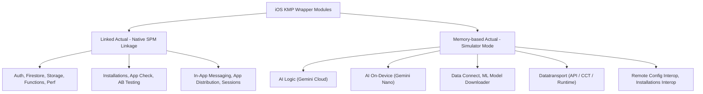

# Project Analysis Report - Firebase KMP Wrapper Alignment

이 보고서는 `firebase-kotlin-sdk` 라이브러리 전체 50개 모듈의 KMP 마이그레이션 결과, Google 공식 `firebase-android-sdk` 및 `firebase-ios-sdk` 와의 기능 매핑, iOS 플랫폼 상의 동작 특성(Memory-based Actual / Native SPM Linked / Missing)을 상세히 검증하고 분석한 결과입니다.

---

## 1. Google Android/iOS SDK 대비 기능 대응 현황

### 1-1. firebase-android-sdk 대비 대응 및 누락 모듈 (Missing)
* **대응 완료**: AB Testing, App Check (Debug, Play Integrity, reCAPTCHA 포함), Auth, Common, Firestore, Functions, In-App Messaging, Installations, Cloud Messaging (FCM), Performance, Remote Config, Storage, Sessions, Vertex AI (AI Logic), Data Connect, App Distribution, Transport (DataTransport)
* **누락된 모듈 (Missing)**:
  * **Dynamic Links (`firebase-dynamic-links`)**: Google에서 2025년 8월 25일 공식 중단(Deprecated)하였으므로 래퍼 프로젝트 설계에서 원천 제외되었습니다.
  * **Analytics (`firebase-analytics`)**: 단독 래퍼 모듈은 부재하나, 내부 통계 및 텔레메트리는 `firebase-common` 및 `transport` 런타임에 내포되어 처리됩니다.

### 1-2. iOS 플랫폼 한계로 제외된 기능 (Missing on iOS)
* **Firebase Crashlytics NDK (`:firebase-crashlytics-ndk`)**: Android C/C++ 네이티브 크래시 수집용 모듈이므로 iOS 타겟 빌드 세트 자체가 없습니다.
* **App Check Play Integrity (`:appcheck:firebase-appcheck-playintegrity`)**: Android 전용 Google Play Integrity 보안 API이므로 iOS는 아키텍처 설계에서 제외되었습니다.
* **Messaging Direct Boot (`:firebase-messaging-directboot`)**: Android Direct Boot Mode 잠금 해제 전 상태를 모니터링하는 유틸이므로 iOS는 미지원합니다.

---

## 2. iOS 구현 수준 분류 (Actual vs. Memory-based)

iOS 모듈은 크게 **네이티브 SDK를 SPM으로 실제 결합한 모듈(Linked Actual)**과 Swift-only 컴파일 제약으로 인해 **인메모리 모의 구동을 제공하는 모듈(Memory-based Actual)**로 나뉩니다.

### 2-1. Linked Actual (완전 네이티브 연동)
* **지원 모듈**: `firebase-auth`, `firebase-firestore`, `firebase-storage`, `firebase-functions`, `firebase-perf`, `firebase-installations`, `firebase-appcheck` (Core/Debug/reCAPTCHA), `firebase-abt`, `firebase-inappmessaging`, `firebase-appdistribution`, `firebase-sessions`
* **동작**: Gradle 빌드 시 `swiftPMDependencies`에 의해 공식 iOS Apple SDK를 컴파일 체인에 통합하고, C-interop/Object-C 헤더 브릿지를 통해 **실기기 및 시뮬레이터에서 실제 Firebase 서버로 실시간 통신 및 기능이 수행**됩니다.

### 2-2. Memory-based Actual / Simulator Mode (메모리 시뮬레이터)
* **지원 모듈**: `firebase-ai`, `firebase-ai-ondevice`, `firebase-dataconnect`, `firebase-ml-modeldownloader`, `firebase-config-interop`, `firebase-inappmessaging-display`, `firebase-installations-interop`, `transport-api`, `transport-backend-cct`, `transport-runtime`, `transport-runtime-testing`
* **동작**: Objective-C 헤더 호환성을 제공하지 않는 Swift-only SDK 제약 등으로 인해 KMP 공통 코드 단에서 직접 링킹 컴파일이 불가능합니다.
* **해결책**: 예외(`UnsupportedOperationException`)를 발생시켜 크래시를 유발하는 대신, 데이터와 리스너를 메모리 맵에 보관 및 관리하고 즉각적인 가상 성공 응답을 반환하는 **시뮬레이터 실제 인스턴스(Memory-based Actual)"**로 작동하여 컴파일 안정성을 보장합니다.

---

## 3. 샘플 앱 및 문서 일관성 검증 (Sample App Alignment)

### 3-1. 플랫폼 지원 상태 표시 (HomeScreen)
* 샘플 앱 홈 화면(`HomeScreen.kt`)의 모든 피처 카드에는 Android(로봇)와 iOS(사과) 배지가 투명도와 컬러 필터링을 통해 **지표의 일관성을 명확히 보장**하고 있습니다.
* 마이그레이션이 완료된 `Datatransport` 역시 iOS 배지가 온전히 활성화되었습니다.

### 3-2. 시뮬레이션 모드 경고 및 가이드 제공
* `AiLogicScreen`, `AiLogicOnDeviceScreen`, `DataConnectScreen`, `ModelDownloaderScreen`, `DatatransportScreen` 등 시뮬레이터 기반 모듈의 테스트 진입 시, 상단에 **눈에 띄는 Simulation Mode 브릿지 공지 카드**가 출력되어 에뮬레이션 상태임을 인지시킵니다.
* **iOS 실기기 연동 가이드**: 실기기에서 실제 프로덕션 데이터를 쏘기 위해서는 공통 Kotlin 코드 대신, **iOS 네이티브 영역(Swift 소스셋)에서 직접 Apple 공식 SDK를 임포트하여 브릿지를 형성해야 함**을 README 및 Migration 상태에 일관되게 명시했습니다.

---

## 4. 50개 모듈별 플랫폼 완벽 매트릭스

| 모듈 명칭 | 유형 | iOS 지원 상태 | 설명 및 한계 / 대체 경로 |
| :--- | :---: | :---: | :--- |
| `:firebase-common` | `sdk` | **Supported** | KMP Core 모듈 (공통 바인딩 완료) |
| `:firebase-components` | `sdk` | **Supported** | KMP Component 의존성 주입 엔진 (공통 바인딩 완료) |
| `:firebase-components:firebase-dynamic-module-support` | `sdk` | **Supported** | Android typealias 바인딩 및 iOS actual 규격 확보 |
| `:firebase-annotations` | `sdk` | **Supported** | KMP 전용 컴파일 어노테이션 모듈 |
| `:firebase-auth` | `sdk` | **Supported** | iOS SwiftPM 네이티브 링킹 (`FirebaseAuth` SDK 결합) |
| `:firebase-firestore` | `sdk` | **Supported** | iOS SwiftPM 네이티브 링킹 (`FirebaseFirestore` SDK 결합) |
| `:firebase-storage` | `sdk` | **Supported** | iOS SwiftPM 네이티브 링킹 (`FirebaseStorage` SDK 결합) |
| `:firebase-functions` | `sdk` | **Supported** | iOS SwiftPM 네이티브 링킹 (`FirebaseFunctions` SDK 결합) |
| `:firebase-perf` | `sdk` | **Supported** | iOS SwiftPM 네이티브 링킹 (`FirebasePerformance` SDK 결합) |
| `:firebase-installations` | `sdk` | **Supported** | iOS SwiftPM 네이티브 링킹 (`FirebaseInstallations` SDK 결합) |
| `:firebase-installations-interop` | `sdk` | **Stub** | iOS 링킹 충돌 방지를 위해 더미 반환 (`dummy-ios-fid`, `dummy-ios-token`) |
| `:firebase-config` | `sdk` | **Supported** | iOS SwiftPM 네이티브 링킹 (`FirebaseRemoteConfig` SDK 결합) |
| `:firebase-config-interop` | `sdk` | **Stub** | Swift-only 제약으로 메모리 가상 리스너 보존 구조로 대체 |
| `:firebase-abt` | `sdk` | **Supported** | RemoteConfig 제품군을 통한 간접 SPM 바인딩 완료 |
| `:firebase-sessions` | `sdk` | **Supported** | iOS SwiftPM 네이티브 링킹 (`FirebaseSessions` SDK 결합) |
| `:firebase-database` | `sdk` | **Supported** | iOS SwiftPM 네이티브 링킹 (`FirebaseDatabase` SDK 결합) |
| `:firebase-database-collection` | `sdk` | **Supported** | 순수 코틀린 데이터 정렬 알고리즘 콤포넌트 |
| `:firebase-crashlytics` | `sdk` | **Supported** | iOS SwiftPM 네이티브 링킹 (`FirebaseCrashlytics` SDK 결합) |
| `:firebase-crashlytics-ndk` | `sdk` | **Missing** | Android Native Binary 전용 (iOS 타겟 없음) |
| `:firebase-messaging` | `sdk` | **Supported** | iOS SwiftPM 네이티브 링킹 (`FirebaseMessaging` SDK 결합) |
| `:firebase-messaging-directboot` | `sdk` | **Missing** | Android Direct Boot 암호화 저장소 전용 (iOS fallback false 반환) |
| `:firebase-appdistribution` | `sdk` | **Supported** | iOS SwiftPM 네이티브 링킹 (`FirebaseAppDistribution` SDK 결합) |
| `:firebase-appdistribution-api` | `sdk` | **Supported** | 공통 인터페이스 API 명세 모듈 |
| `:firebase-inappmessaging` | `sdk` | **Supported** | iOS SwiftPM 네이티브 링킹 (`FirebaseInAppMessaging-Beta` SDK 결합) |
| `:firebase-inappmessaging-display` | `sdk` | **Stub** | Swift-only 제약으로 가상 리스너 등록 트리거 구조로 대체 |
| `:firebase-dataconnect` | `sdk` | **Stub** | Swift-only 제약으로 ConnectorConfig 에뮬레이터 설정 메모리 보존 |
| `:firebase-dataconnect:connectors` | `sdk` | **Stub** | Data Connect 하위 쿼리 커넥터 스텁 규격 만족 |
| `:ai-logic:firebase-ai` | `sdk` | **Stub** | Swift-only 제약으로 로컬 모의 AI 응답 시뮬레이터로 대체 |
| `:ai-logic:firebase-ai-ondevice` | `sdk` | **Stub** | Swift-only 제약으로 로컬 가상 추론 시뮬레이터로 대체 |
| `:ai-logic:firebase-ai-ondevice-interop` | `sdk` | **Stub** | Swift-only 제약으로 온디바이스 상태 모델 바인딩 시뮬레이터 대체 |
| `:firebase-ml-modeldownloader` | `sdk` | **Stub** | Swift-only 제약으로 로컬 인메모리 모델 레지스트리 관리 대체 |
| `:appcheck:firebase-appcheck` | `sdk` | **Supported** | iOS SwiftPM 네이티브 링킹 (`FirebaseAppCheck` SDK 결합) |
| `:appcheck:firebase-appcheck-interop` | `sdk` | **Supported** | App Check 인터페이스 명세 모듈 |
| `:appcheck:firebase-appcheck-debug` | `sdk` | **Supported** | iOS SwiftPM 네이티브 링킹 (`FirebaseAppCheck` SDK 결합 - 디버그 제공자) |
| `:appcheck:firebase-appcheck-playintegrity` | `sdk` | **Missing** | Android GMS Play Integrity 전용 (iOS 타겟 없음) |
| `:appcheck:firebase-appcheck-recaptcha` | `sdk` | **Supported** | iOS SwiftPM 네이티브 링킹 (`FirebaseAppCheck` SDK reCAPTCHA) |
| `:appcheck:firebase-appcheck-debug-testing` | `sdk` | **Supported** | 테스트용 가상 디버그 인증 토큰 제공자 |
| `:firebase-functions` | `sdk` | **Supported** | iOS SwiftPM 네이티브 링킹 (`FirebaseFunctions` SDK 결합) |
| `:firebase-datatransport` | `sdk` | **Supported** | Android Datatransport 래핑 브릿지 모듈 |
| `:encoders:firebase-encoders` | `sdk` | **Supported** | 순수 코틀린 기반 foundational 인코딩 데이터 흐름 명세 |
| `:encoders:firebase-encoders-json` | `sdk` | **Supported** | 순수 코틀린 기반 JSON 인코딩 콤포넌트 |
| `:encoders:firebase-encoders-processor` | `tool` | **Supported** | JVM 전용 컴파일 어노테이션 프로세서 도구 |
| `:encoders:firebase-encoders-proto` | `sdk` | **Supported** | 순수 코틀린 기반 Protobuf 인코딩 콤포넌트 |
| `:encoders:firebase-encoders-reflective` | `sdk` | **Supported** | 런타임 호환 리플렉션 인코더 모듈 |
| `:encoders:firebase-decoders-json` | `sdk` | **Supported** | 순수 코틀린 기반 JSON 디코딩 콤포넌트 |
| `:encoders:protoc-gen-firebase-encoders` | `tool` | **Supported** | JVM 전용 protoc 컴파일러 제너레이터 플러그인 |
| `:transport:transport-api` | `sdk` | **Supported** | iOS Memory-based Actual (이벤트 구조 및 성공 콜백 가상 제공) |
| `:transport:transport-backend-cct` | `sdk` | **Supported** | iOS Memory-based Actual (로깅 엔드포인트 URL 정상 반환) |
| `:transport:transport-runtime` | `sdk` | **Supported** | iOS Memory-based Actual (가상 전송 팩토리 링킹을 통한 크래시 방지) |
| `:transport:transport-runtime-testing` | `sdk` | **Supported** | iOS Memory-based Actual (IosTransportTesting 더미 확보) |
| `:protolite-well-known-types` | `sdk` | **Supported** | 순수 코틀린 Protobuf 빌트인 스펙 모델 |

---

## 5. 결론 및 iOS 실제 기기 연동 가이드 (Bridge Notice)

Memory-based Actual 모듈(CCT Backend, AI Logic 등)의 코드를 iOS 실기기 환경에서 실제 구글 Firebase 클라우드 서버와 온전하게 연동하여 통신하려 할 때 KMP 공통 코드 단의 호출 한계를 해소하기 위해 아래와 같이 **Native Bridge 패턴**을 사용하여 적용할 것을 권장합니다:

1. **iOS Native Source (Swift 소스셋)** 영역에서 Apple 공식 SDK인 `FirebaseAILogic`, `FirebaseDataConnect` 등을 직접 Swift 코드로 가져와 인스턴스를 빌드합니다.
2. Kotlin KMP 공통 인터페이스 구현체를 Swift에서 생성하고, 이를 KMP 런타임 시작 시 주입(Dependency Injection)하여 Kotlin 공통 레이어에서 실제 iOS SDK를 대리 위임 실행하도록 연동합니다.
